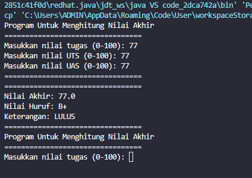
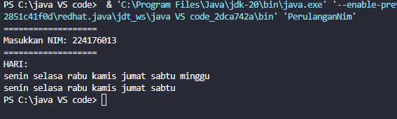
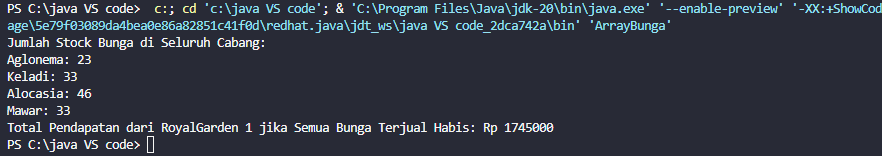
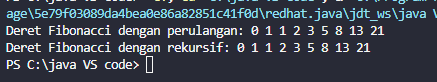
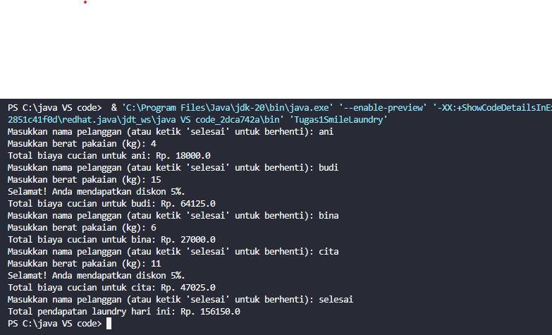
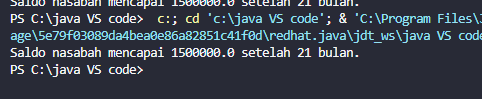
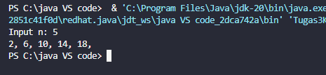
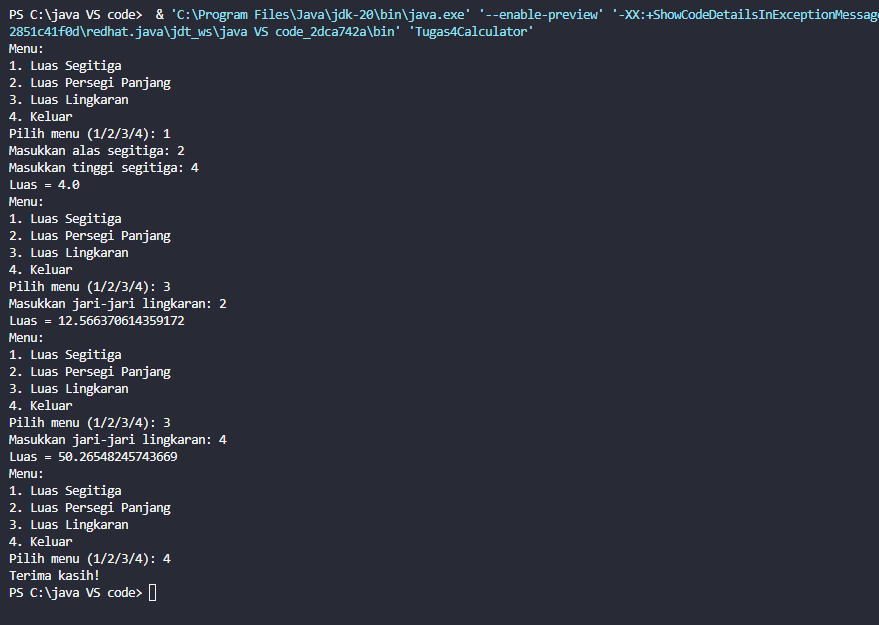

# LAPORAN PRAKTIKUM 1

Nama  : M. Hasan Basri

Kelas : SIB 2c

NIm   : 2241760139

## 1.2.1 Praktikum Pemilihan
1. Buatlah program untuk menghitung nilai akhir dari mahasiswa dengan ketentuan 20% nilai 
tugas, 35% nilai UTS dan 45% nilai UAS. Setiap nilai yang dimasukkan mempunyai batas nilai 
0 ‐ 100. Jika Nilai Huruf yang didapatkan adalah A,B+,B+C+,C maka LULUS,  jika nilai huruf D dan E maka 
TIDAK LULUS.
• Input dari program berupa komponen nilai tugas, UTS, UAS
• Output dari program berupa hasil nilai akhir, nilai huruf, dan keterangan 
LULUS/TIDAK LULUS
### Jawab :

## 1.3 Perulangan
1. Buatlah program yang dapat menampilkan nama hari dari senin hingga minggu secara 
berulang dengan jumlah hari sebesar n, dengan n = 2 digit terakhir NIM anda. 
*bila n<10 maka tambahkan 10 (n+=10)
### Jawab :

## 1.4 Array
RoyalGarden adalah toko bunga yang memiliki banyak cabang. Setiap hari Stock Bunga dan 
bunga-bunga yang dijual selalu dicatat dengan rincian seperti berikut ini:
Baris = Cabang Toko, Kolom = Stock bunga pada hari x

Rincian Harga Aglonema =75.000 , Keladi = 50.000, Alocasia =60.000, Mawar =10.000. 
Bantulah RoyalGarden dengan membuatkan program yang dapat menghitung : 
A. Jumlah Stock berdasarkan jenis bunganya di seluruh Cabang
B. Jika terdapat informasi tambahan berupa pengurangan stock karena bunga tersebut 
mati pada cabang RoyalGarden 1. Dengan rincian Aglonema -1, Keladi -2, Alocasia -0, 
Mawar -5. Maka berapakah total pendapatan dari RoyalGarden 1 jika semua Bunga 
Terjual Habis

### Jawab : 

## 1.5.1 Praktikum Fungsi
1. Buatlah dua fungsi masing-masing, untuk:
a. Menampilkan deret fibonacci dengan menggunakan konsep perulangan.
b. Menampilkan deret fibonacci dengan menggunakan fungsi rekursif.
### Jawab :

## 1.5 Tugas

# 1. 
# 2. 
# 3. 
# 4. 
