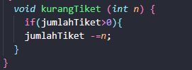

# Laporan Praktikum Pertemuan 2
### Nama : M. Hasan Basri
### Kelas: SIB 2C
### Absen: 14
### NIM  : 2241760139

## 2.2.1 Langkah-langkah Percobaan

1. Buat Project baru, dengan nama StrukturData. Buat paket dengan nama minggu2 (opsional). buatlah class baru dengan nama Film
2. Lengkapi class Film dengan atribut dan method yang telah digambarkan di dalam diagram class di atas, sebagai berikut:

3. Coba jalankan (Run) class Barang tersebut. Apakah bisa?

Tidak bisa, karena tidak ada main nya.
## 2.2.3 Pertanyaan
1. Sebutkan 2 karakteristik class/objek!
2. Kata kunci apakah yang digunakan untuk mendeklarasikan class?
3. Perhatikan class Film yang ada di Praktikum di atas, ada berapa atribut yang dimiliki oleh class 
tersebut? Sebutkan! Dan pada baris berapa saja deklarasi atribut dilakukan?
4. Ada berapa method yang dimiliki oleh class tersebut? Sebutkan!
5. Perhatikan method kurangiTiket() yang ada di class Film, modifikasi isi method tersebut 
sehingga proses pengurangan hanya dilakukan jika stok masih ada (masih lebih besar dari 0) 
6. Menurut Anda, mengapa method tambahTiket() dibuat dengan memiliki 1 parameter berupa 
bilangan int?
7. Menurut Anda, mengapa method totalRevenue() memiliki tipe data int?
8. Menurut Anda, mengapa method tambahTiket() memiliki tipe data void?
#### jawab :
1. Karakteristik class/objek dalam pemrograman berorientasi objek adalah encapsulation(Pembungkus) dan Inheritance(Pewarisan).
2. Kata kunci yang digunakan adalah "class". 
3. Ada 5 atribut. yaitu :

     
4. Ada 4 yaitu, tampilFilm,TambahTiket, KurangiTiket, TotalRevenue

5.  

6. Agar memungkinkan untuk menambahkan jumlah tiket terjual dengan sejumlah tiket yang ditentukan oleh pengguna saat memanggil metode tersebut.

7. karena metode ini bertujuan untuk mengembalikan nilai integer yang merupakan total pendapatan dari penjualan tiket.

8. karena metode ini seharusnya hanya bertanggung jawab untuk mengubah nilai atribut jumlahTiket dalam objek Film dan tidak perlu mengembalikan nilai apapun. 
## 2.3 Instansiasi Objek dan Mengakses Atribut & Method
### 2.3.1 Langkah-langkah Percobaan
1. Buatlah class baru dengan nama FilmMain. Dan di dalam class FilmMain tersebut, buatlah 
method main().
2. Di dalam method main(), lakukan instansiasi, dan kemudian lanjutkan dengan mengakses atribut 
dan method dari objek yang telah terbentuk.

3. Jalankan (Run) class FilmMain tersebut dan amati hasilnya.

### 2.3.3 Pertanyaan
1. Pada class FilmMain, pada kode apa yang digunakan untuk proses instansiasi? Apa nama objek 
yang dihasilkan?
2. Bagaimana cara mengakses atribut dan method dari suatu objek?
### Jawab
1. Film film1 = new Film(); Objek yang dihasilkan film1
2. * Untuk mengakses atribut dapat dilakukan dengan namaObjek.namaAtribut = nilai; 
    * Untuk mengakses method dapat dilakukan dengan namaObjek.namaMethod();
## 2.4 Membuat Konstruktor
1. Perhatikan kembali class Film. Tambahkan di dalam class Film tersebut 2 buah konstruktor. 1 
konstruktor default dan 1 konstruktor berparameter

2. Buka kembali class FilmMain. Dan buat sebuah objek lagi, kali ini dengan menggunakan 
konstruktor berparameter.

3. Jalankan kembali class FilmMain dan amati hasilnya.

### Jawab :
1. Pada baris ke 8, yaitu : Film(String jd, String gr, String rt, int jt, int ht)

2. Ini adalah proses pembuatan objek baru dari kelas Film menggunakan konstruktor parameter

3. Film film3 = new Film("Film Tiga", "Drama", "Remaja", 1500, 35000);

## 2.5 Membuat Array dari Object, Mengisi dan Menampilkan

Hasil running 

### jawab :
1. Tidak, class yang akan digunakan untuk membuat array of objects tidak selalu harus memiliki atribut dan method. Dalam pemrograman berorientasi objek, class adalah blueprint atau cetak biru untuk objek yang akan dibuat. 
2. Dalam pemrograman berorientasi objek, class PersegiPanjang biasanya akan memiliki konstruktor. pada program tersebut sebenarnya bukan pemanggilan konstruktor dari class PersegiPanjang. Ini adalah inisialisasi array dari objek PersegiPanjang. Baris program tersebut membuat array pparray yang dapat menyimpan tiga objek PersegiPanjang.
3. kode di atas adalah penggunaan array dan objek dari class PersegiPanjang dalam bahasa pemrograman.kode tersebut membuat objek PersegiPanjang baru, menyimpannya dalam array, dan kemudian mengatur nilai panjang dan lebar objek tersebut melalui array. 
4.  untuk memisahkan tanggung jawab dan memisahkan kepentingan dalam desain berorientasi objek. Hal ini memungkinkan kode menjadi lebih terstruktur, mudah dibaca, dan lebih mudah dikelola.
## 2.6 Menerima Input Isian Array Menggunakan Looping

### 2.6.3 Pertanyaan
1. Apakah array of object dapat diimplementasikan pada array 2 Dimensi?
2. Jika jawaban soal no satu iya, berikan contohnya! Jika tidak, jelaskan!
3. Jika diketahui terdapat class Persegi yang memiliki atribut sisi bertipe integer, maka kode 
dibawah ini akan memunculkan error saat dijalankan. Mengapa?

4. Modifikasi kode program pada praktikum 3.3 agar length array menjadi inputan dengan Scanner!
5. Apakah boleh Jika terjadi duplikasi instansiasi array of objek, misalkan saja instansiasi dilakukan 
pada ppArray[i] sekaligus ppArray[0]?Jelaskan 
### Jawab :
1. Ya, Anda bisa mengimplementasikan array of object pada array dua dimensi.

2. 

3. Saat membuat sebuah array dari objek persegi, tetapi belum di inisialisasi objek-objek persegi dalam array tersebut. Saat membuat array, semua elemen di dalamnya diatur ke nilai default null untuk tipe objek, dan perlu secara eksplisit membuat objek untuk setiap elemen array sebelum dapat mengakses atribut atau metode mereka.
4. 
5. Ya, dalam bahasa Java, dapat menginstansiasi objek array dengan cara yang sama pada elemen yang berbeda. Dalam hal ini, jika menginstansiasi ppArray[i] dan ppArray[0] dengan objek yang sama, ini tidak akan menyebabkan masalah. Kedua elemen array akan mengacu pada objek yang sama di dalam memori.

## 2.7 Operasi Matematika Atribut Object Array
### 2.7.3 Pertanyaan
1. Dapatkah konstruktor berjumlah lebih dalam satu kelas? Jelaskan dengan contoh!
2. Jika diketahui terdapat class Segitiga seperti berikut ini:
Tambahkan konstruktor pada class Segitiga tersebut yang berisi parameter int a, int t
yang masing-masing digunakan untuk mengisikan atribut alas dan tinggi.

3. Tambahkan method hitungLuas() dan hitungKeliling() pada class Segitiga
tersebut. Asumsi segitiga adalah segitiga siku-siku. (Hint: Anda dapat menggunakan
bantuan library Math pada Java untuk mengkalkulasi sisi miring)
4. Pada fungsi main, buat array Segitiga sgArray yang berisi 4 elemen, isikan masingmasing atributnya sebagai berikut:
sgArray ke-0 alas: 10, tinggi: 4
sgArray ke-1 alas: 20, tinggi: 10
sgArray ke-2 alas: 15, tinggi: 6
sgArray ke-3 alas: 25, tinggi: 10
Kemudian menggunakan looping, cetak luas dan keliling dengan cara memanggil method 
hitungLuas() dan hitungKeliling()
